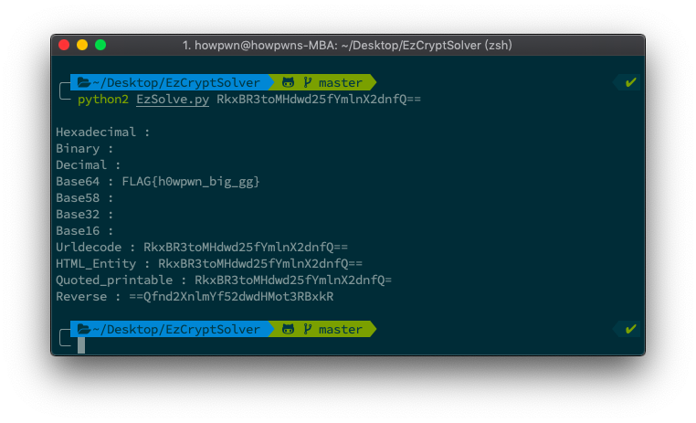
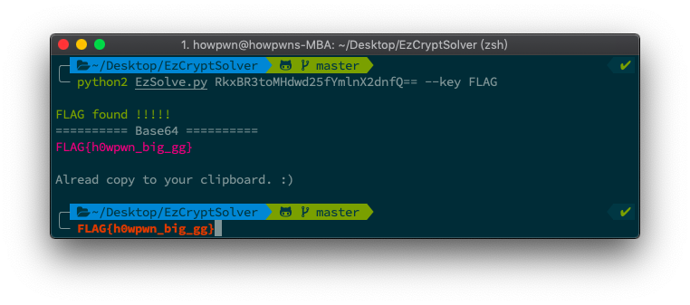
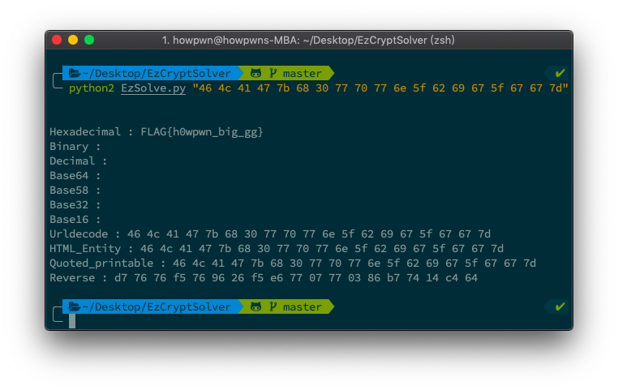
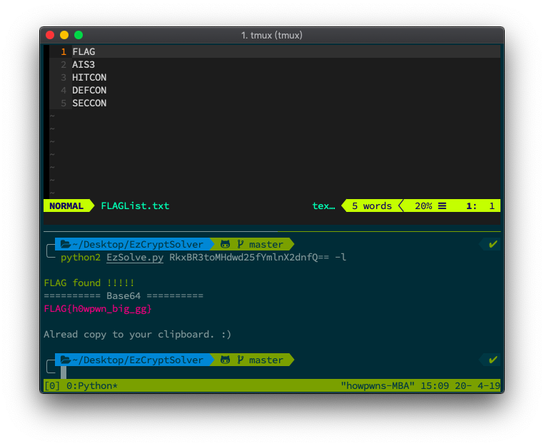
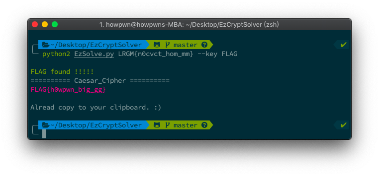

# EzCryptSolver

This tool is to solve CTF decoding baby first Problem.
Give me your cipher, and i will decrypt/decode it！

Inspiration from [kaibro's EasyWebSolver](https://github.com/w181496/EasySolver)

# Feature

- Brute force all possible encode
- Specifie FLAG header
- If find the FLAG, automatic copy to your clipboard
- Brute force Classical cipher supported
- Specifie FLAG header as your custom list

# Requisites

python2.7 & pip2

# Install

1. Clone this repo

```Shell
git clone https://github.com/finn79426/EzCryptSolver.git
```

2. Using pip to get essential libraries

```shell
cd EzCryptSolver
pip2 install -r requirements.txt --user
```

# Usage

For example (Base64)：

```Shell
python2 EzSolve.py RkxBR3toMHdwd25fYmlnX2dnfQ==
```

Now, you will get output like this：


And also, you can specifie CTF FLAG header, just add `--key` argument.

```Shell
python2 EzSolve.py RkxBR3toMHdwd25fYmlnX2dnfQ== --key FLAG
```

Now, you will get output like this：



If not find any compare FLAG, just no output.

If your ciphertext has white-space or any special character, Enclose them in quotation marks, otherwise you will get an Error.

```Shell
python2 EzSolve.py "46 4c 41 47 7b 68 30 77 70 77 6e 5f 62 69 67 5f 67 67 7d"
```




You can preparatory CTFs FLAG header, so you don't have to use `--key` anymore!

Add `-l` to enable longlist support:
```
python2 EzSolve.py RkxBR3toMHdwd25fYmlnX2dnfQ== -l
```



By the way, Only using `--key` or `-l` can get Brute Force output, like this：
```
python2 EzSolve.py LRGM{n0cvct_hom_mm} --key FLAG
```



# Algorithm completed

- Encode transform
  - [x] Hex
  - [x] Binary
  - [x] Decimal
  - [x] Base64
  - [x] Base58
  - [x] Base32
  - [x] Base16
  - [x] URLencoded
  - [x] HTML Entity
  - [x] Quoted-printable
- Brute force (Enable when using `-l` or `--key`)
  - [x] Transposition Cipher
  - [x] Caesar cipher
- Others
  - [x] Reverse String

# Contact

My Email：finn79426@gmail.com

如果你找到 Bug 或 Error msg，發給我一個 issues <br>
或者如果你有更好的想法，歡迎 Fork、PR

# How to remove

```Shell
pip2 uninstall -r requirements.txt --yes
cd ../
rm EzCryptSolve -r
```
